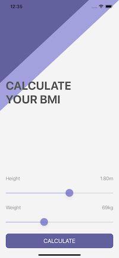
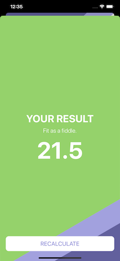
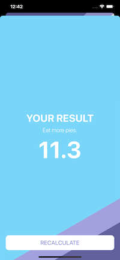
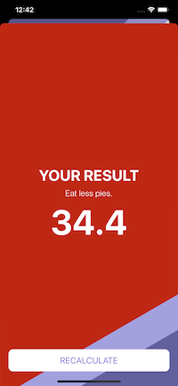

#  BMI Calculator

A Body Mass Index calculator. Based on the user’s weight and height it will calculate their body mass and give a piece of health advice depending on whether if they have eaten too many pies or if they need to eat more pies. 

* Creating multi-screen apps with animated navigation.
* Optional binding, optional chaining and the nil coalescing operator.
* Formatting Strings. 
* Color literals.

